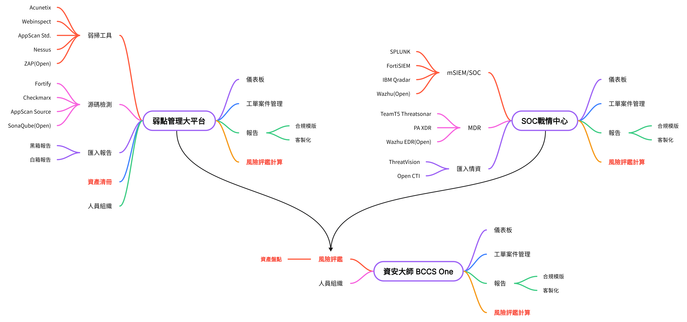

# 弱點掃描管理平台 - 功能完成狀態分析報告

**Date:** 2026-03-30
**Status:** Complete
**Author:** VulnScan Team
**Project Location** /Users/r_r/Downloads/BCCS-VulnScan-master

---

## 平台架構總覽## 平台架構總覽



```
┌─────────────────────────────────────────────────────────────────────────────────┐
│  匯入階段        │  技服作業         │  測試循環          │  客戶端            │
│  (已完成)        │  (部分完成)       │  (規劃中)          │  (規劃中)          │
├─────────────────────────────────────────────────────────────────────────────────┤
│  弱掃工具        │  OWASP 分類       │  初測 -> 客戶修復  │  客戶登入          │
│      |           │  弱點驗證         │      |             │  查看報告          │
│  產出報告        │  修復建議         │  複測              │  查看進度          │
│  (JSON/HTML)     │      |            │      |             │  修復狀態          │
│      |           │  產出報告         │  還有弱點?         │                    │
│  匯入系統 -> DB  │                   │  是 -> 回到修復    │                    │
│                  │                   │  否 -> 結案        │                    │
└─────────────────────────────────────────────────────────────────────────────────┘
```

---

## 1. 架構解讀

### 1.1 弱點掃描平台資料來源

| 資料來源       | 整合工具                         | 說明                                       |
| -------------- | -------------------------------- | ------------------------------------------ |
| **Acunetix**   | Acunetix VM (REST + GraphQL API) | 網站弱點掃描工具，目前唯一已整合的掃描引擎 |
| **Nessus**     | (規劃中)                         | 網路弱點掃描工具，尚未實作                 |
| **其他掃描器** | (規劃中)                         | 預留擴充架構，支援多工具整合               |

### 1.2 弱點掃描平台核心功能

| 核心功能     | 子功能                         | 說明                           |
| ------------ | ------------------------------ | ------------------------------ |
| **認證系統** | 系統登入、工具選擇、帳號鎖定   | JWT 認證 + 兩步驟登入流程      |
| **掃描管理** | 目標管理、掃描控制、進度監控   | 透過 Acunetix API 操作掃描任務 |
| **弱點管理** | 弱點檢視、匯出、同步至本地 DB  | 從掃描工具同步弱點到本地資料庫 |
| **報告產出** | 模板選擇、PDF/HTML 產出、下載  | 使用 Acunetix 內建報告引擎     |
| **派工系統** | 工單建立、狀態流轉、轉派、拒絕 | 完整工單生命週期管理           |
| **通知系統** | 系統內通知、未讀計數           | 工單狀態變更通知               |
| **儀表板**   | 統計卡片、弱點摘要、最近掃描   | 即時監控與統計                 |

### 1.3 三大平台對照

本系統對應 BCCS 架構中「弱點管理大平台」角色，與 SOC 戰情中心、資安大師 BCCS One 共享相同的四大功能模組設計：

| 功能模組                 | 弱點管理大平台 (本系統) | SOC 戰情中心 | 資安大師 BCCS One |
| ------------------------ | ----------------------- | ------------ | ----------------- |
| 儀表板                   | V (基礎版)              | V            | V                 |
| 工單案件管理             | V (派工系統)            | V            | V                 |
| 報告 (合規模版 + 客製化) | V (Acunetix 報告)       | V            | V                 |
| 風險評鑑計算             | --                      | --           | --                |

---

## 2. 功能完成狀態

### 2.1 已完成功能

| 功能                  | 完成度 | 說明                                                                                                          |
| --------------------- | ------ | ------------------------------------------------------------------------------------------------------------- |
| **認證系統 (JWT)**    | 95%    | 兩步驟登入 (系統登入 + 工具選擇)、帳號鎖定 (5次失敗鎖15分鐘)、JWT Token 管理                                  |
| **掃描工具管理**      | 90%    | 工具列表、自動連接 (使用資料庫存放的加密密碼)、新增工具 (admin)                                               |
| **掃描目標管理**      | 90%    | 新增/刪除目標、掃描設定檔選擇 (Full Scan/XSS/SQL Injection 等)、掃描速度調節、站台登入設定                    |
| **掃描任務控制**      | 90%    | 啟動/中止/恢復/刪除掃描、進度監控 (5秒自動刷新)、批次操作 (全選/批次停止/批次刪除)、篩選 (執行中/已完成/失敗) |
| **弱點檢視與匯出**    | 85%    | 弱點列表 (嚴重度分級)、匯出 JSON/XML 格式、弱點同步至本地資料庫                                               |
| **報告管理**          | 85%    | 報告模板選擇 (Standard + Compliance)、PDF/HTML 產出、下載、刪除、自動輪詢等待產出完成                         |
| **派工系統 (工單)**   | 85%    | 工單建立 (單一/批次)、狀態流轉 (pending -> in_progress -> pending_verify -> closed)、轉派/拒絕、工單歷程記錄  |
| **通知系統**          | 80%    | 工單狀態變更通知、未讀計數、標記已讀 (單一/全部)、刪除通知                                                    |
| **儀表板**            | 80%    | 統計卡片 (目標數/掃描數/執行中/報告數)、弱點嚴重度摘要 (5級)、最近掃描列表、5秒自動刷新                       |
| **資料同步機制**      | 85%    | 啟動掃描時自動建立 Project + Scan 記錄、手動同步弱點至本地 DB、欄位對應完整                                   |
| **密碼加密儲存**      | 90%    | Fernet 對稱加密、PBKDF2 金鑰衍生、向下相容明文密碼                                                            |
| **前端架構 (模組化)** | 90%    | ScannerView 拆分為 8 個獨立 View、嵌套路由、Pinia 狀態管理 (auth + scanner)                                   |

### 2.2 未完成功能

| 功能                     | 完成度 | 說明                                                                       |
| ------------------------ | ------ | -------------------------------------------------------------------------- |
| **OWASP 弱點分類**       | 5%     | DB 欄位已定義 (OwaspCategory A01-A10)，但無前端 UI 操作介面                |
| **弱點驗證 (真/假陽性)** | 5%     | DB 欄位已定義 (IsValid, TechNotes)，但無前端 UI 操作介面                   |
| **修復建議撰寫**         | 5%     | DB 欄位已定義 (Recommendation, FixStatus)，但僅使用 Acunetix 原始資料      |
| **自訂報告模板**         | 0%     | 目前僅使用 Acunetix 內建報告模板，無自訂報告引擎                           |
| **逾期提醒排程**         | 5%     | NotificationSettings 資料表已建立 (含分級提醒時間)，但無背景排程任務       |
| **Email 通知**           | 5%     | DB 欄位已定義 (IsSentEmail, EmailSentAt)，但 SMTP 整合未實作               |
| **使用者管理介面**       | 10%    | 有 GET /api/users 列表 API，但無建立/編輯/停用使用者的管理頁面             |
| **密碼重設**             | 5%     | DB 欄位已定義 (ResetPasswordToken)，但 API 端點未實作                      |
| **Nessus 整合**          | 0%     | 僅有 ToolType 欄位預留，無 Nessus API 客戶端                               |
| **初測/複測比對**        | 0%     | DB 有 ScanType (initial/retest) 欄位，但無比對邏輯與 UI                    |
| **結案流程**             | 0%     | 無弱點全數修復後的自動結案機制                                             |
| **客戶端入口**           | 0%     | 無客戶登入、報告查看、修復狀態回報功能                                     |
| **風險評鑑計算**         | 0%     | 無風險評分模型或計算引擎                                                   |
| **稽核日誌 UI**          | 5%     | DB 有 CreatedBy/UpdatedBy 追蹤，WorkOrderLogs 有完整記錄，但無獨立稽核頁面 |

---

## 3. 模組功能分析

### 3.1 認證與授權模組

| 功能               | 實作方式                                                      | 程式碼現況 |
| ------------------ | ------------------------------------------------------------- | ---------- |
| **系統登入**       | POST /api/auth/login -> JWT Token (HS256, 24h 有效期)         | 已完成     |
| **帳號鎖定**       | 5 次失敗鎖定 15 分鐘，自動解除                                | 已完成     |
| **工具選擇**       | 卡片式 UI 選擇，POST /api/scanner-tools/{id}/connect 自動連接 | 已完成     |
| **密碼加密**       | bcrypt 雜湊 (使用者密碼)、Fernet 對稱加密 (工具密碼)          | 已完成     |
| **Token 管理**     | localStorage 儲存、Axios 攔截器自動帶入、401 自動登出         | 已完成     |
| **多角色 (RBAC)**  | DB 有 Role 欄位 (admin/user)，但無完整角色權限控制 UI         | 部分完成   |
| **密碼重設**       | DB 欄位已定義，API 未實作                                     | 未實作     |
| **MFA 雙因素驗證** | 無                                                            | 未實作     |

### 3.2 掃描操作模組 (Acunetix 整合)

| 功能                | 實作方式                                                     | 程式碼現況 |
| ------------------- | ------------------------------------------------------------ | ---------- |
| **目標管理 (CRUD)** | 前端傳遞 {tool, host, token} -> 後端 AcunetixClient 代理呼叫 | 已完成     |
| **掃描啟動/控制**   | 支援 Full Scan / High Risk / XSS / SQL Injection 等設定檔    | 已完成     |
| **掃描進度監控**    | 5 秒自動輪詢、進度條顯示、嚴重度計數                         | 已完成     |
| **批次操作**        | 全選/反選、批次中止、批次刪除                                | 已完成     |
| **弱點匯出**        | JSON/XML 格式匯出，XML 含 metadata + severity summary        | 已完成     |
| **報告產出**        | Acunetix 內建模板 (Standard 5種 + Compliance 6種)            | 已完成     |
| **報告下載**        | StreamingResponse 串流下載 PDF/HTML                          | 已完成     |
| **站台登入設定**    | basic_auth / ntlm / kerberos / BLR 錄製                      | 已完成     |

### 3.3 本地資料管理模組

| 功能               | 實作方式                                                           | 程式碼現況 |
| ------------------ | ------------------------------------------------------------------ | ---------- |
| **專案自動建立**   | 啟動掃描時，Target.Description -> Project.Name                     | 已完成     |
| **掃描記錄同步**   | ExternalScanID + ExternalResultID 對應                             | 已完成     |
| **弱點同步**       | 手動觸發「Sync to DB」，批次 insert/update Vulnerabilities         | 已完成     |
| **弱點分級統計**   | 同步時更新 Scan 的 VulnCount (Critical/High/Medium/Low/Info)       | 已完成     |
| **OWASP 分類標記** | DB 欄位存在，無 UI 操作                                            | 未實作     |
| **真/假陽性驗證**  | DB 欄位存在 (IsValid)，無 UI 操作                                  | 未實作     |
| **修復狀態追蹤**   | DB 欄位存在 (FixStatus: pending/fixed/partial/wontfix)，無 UI 操作 | 未實作     |

### 3.4 派工系統模組

| 功能               | 實作方式                                                         | 程式碼現況 |
| ------------------ | ---------------------------------------------------------------- | ---------- |
| **工單建立**       | 單一/批次建立，關聯弱點 + 掃描 + 指派對象 + 期限 + 優先級        | 已完成     |
| **狀態流轉**       | pending -> in_progress -> pending_verify -> closed (含 rejected) | 已完成     |
| **接單/提交/結案** | 對應 accept / submit / close API                                 | 已完成     |
| **轉派**           | transfer API，變更 AssignedToUserID                              | 已完成     |
| **拒絕 (含原因)**  | reject API，記錄 RejectReason                                    | 已完成     |
| **複測未通過**     | retest-failed API，pending_verify -> in_progress 回退            | 已完成     |
| **工單歷程**       | WorkOrderLogs 完整記錄每次狀態轉換 + 操作人 + 備註               | 已完成     |
| **檢視模式**       | 「指派給我」/「我建立的」雙檢視模式                              | 已完成     |
| **逾期提醒**       | NotificationSettings 已建立分級提醒設定，無排程執行              | 未實作     |

### 3.5 通知系統模組

| 功能                     | 實作方式                                                              | 程式碼現況 |
| ------------------------ | --------------------------------------------------------------------- | ---------- |
| **系統內通知**           | 工單狀態變更時自動建立 Notification 記錄                              | 已完成     |
| **通知類型**             | 10 種類型 (created/accepted/transferred/submitted/closed/rejected 等) | 已完成     |
| **未讀計數**             | GET /api/notifications/unread-count，側邊欄紅色徽章顯示               | 已完成     |
| **標記已讀**             | 單一/全部已讀                                                         | 已完成     |
| **即時推播 (WebSocket)** | 無，僅依賴 API 輪詢                                                   | 未實作     |
| **Email 通知**           | DB 欄位存在，SMTP 未整合                                              | 未實作     |

---

## 4. 整體完成度評估

### 4.1 以系統流程為基準

| 評估項目                          | 完成度     | 備註                                                       |
| --------------------------------- | ---------- | ---------------------------------------------------------- |
| 基礎架構 (認證/JWT/帳號鎖定/加密) | 90%        | 核心認證流程完整，缺密碼重設與 RBAC 管理 UI                |
| 匯入階段 (Acunetix 整合)          | 90%        | 掃描全流程完整，目標/掃描/報告/弱點均可操作                |
| 資料同步 (本地 DB)                | 85%        | 專案/掃描/弱點同步機制完整，手動觸發                       |
| 派工系統 (工單管理)               | 85%        | 完整狀態流轉，缺逾期提醒排程                               |
| 通知系統                          | 70%        | 系統內通知完成，缺 Email 與即時推播                        |
| 儀表板                            | 75%        | 基礎統計完成，缺趨勢圖與進階視覺化                         |
| 技服作業 (OWASP/驗證/建議)        | 5%         | 僅 DB 欄位定義，無前端 UI                                  |
| 測試循環 (初測/複測/結案)         | 0%         | 完全未開始                                                 |
| 客戶端 (客戶登入/報告查看)        | 0%         | 完全未開始                                                 |
| 自訂報告 (使用自己的模板)         | 0%         | 完全未開始，目前僅依賴 Acunetix 報告引擎                   |
| 風險評鑑計算                      | 0%         | 完全未開始                                                 |
| 使用者管理                        | 10%        | 有列表 API，無管理 UI                                      |
| **整體估計**                      | **55-60%** | **匯入階段與派工系統完成度高，技服作業與後續流程尚未開始** |

### 4.2 優先開發建議

| 優先順序 | 功能                           | 理由                                             |
| -------- | ------------------------------ | ------------------------------------------------ |
| 1        | 技服作業系統 (OWASP/驗證/建議) | DB 欄位已就緒，僅需前端 UI；是掃描流程的核心下游 |
| 2        | 使用者管理介面                 | 系統基礎功能，目前僅能透過 init_db.py 建立帳號   |
| 3        | 逾期提醒排程                   | NotificationSettings 已建立，需實作背景排程任務  |
| 4        | 測試循環 (初測/複測)           | 弱點修復驗證的核心流程                           |
| 5        | Email 通知整合                 | SMTP 整合，提升通知的即時性                      |
| 6        | 自訂報告模板                   | 脫離 Acunetix 報告依賴，產出符合企業需求的報告   |
| 7        | 客戶端入口                     | 讓客戶直接查看弱點修復進度                       |

---

## 5. 技術架構詳細說明

### 5.1 前端架構

> 技術: Vue 3 + TypeScript + Pinia + Vue Router + Axios + Vite

```
frontend/src/
├── views/
│   ├── LoginView.vue             # 登入頁 (系統登入 + 工具選擇兩步驟)
│   └── scanner/
│       ├── MainLayout.vue        # 主框架 (側邊欄 + 頂部欄 + 內容區)
│       ├── DashboardView.vue     # 儀表板 (統計卡片 + 弱點摘要 + 最近掃描)
│       ├── TargetsView.vue       # 目標管理 (新增/刪除/掃描設定)
│       ├── ScansView.vue         # 掃描列表 (篩選/批次/自動刷新)
│       ├── ScanDetailView.vue    # 掃描詳情 (弱點列表/統計/同步)
│       ├── ReportsView.vue       # 報告管理 (產生/下載/刪除)
│       ├── WorkOrdersView.vue    # 工單管理 (狀態流轉/轉派/拒絕)
│       └── NotificationsView.vue # 通知中心 (已讀/未讀/刪除)
├── stores/
│   ├── auth.ts                   # 認證狀態 (JWT Token + 使用者資訊)
│   └── scanner.ts                # 掃描器狀態 (工具連線 + Token)
├── api/
│   └── index.ts                  # API 封裝 (Axios + Token 攔截器)
└── router/
    └── index.ts                  # 嵌套路由 (/login, /scanner/*)
```

**路由結構：**

| 路徑                     | 元件                  | 說明                |
| ------------------------ | --------------------- | ------------------- |
| `/login`                 | LoginView.vue         | 系統登入 + 工具選擇 |
| `/scanner`               | MainLayout.vue        | 主框架 (redirect)   |
| `/scanner/dashboard`     | DashboardView.vue     | 儀表板              |
| `/scanner/targets`       | TargetsView.vue       | 掃描目標管理        |
| `/scanner/scans`         | ScansView.vue         | 掃描列表            |
| `/scanner/scans/:id`     | ScanDetailView.vue    | 掃描詳情            |
| `/scanner/reports`       | ReportsView.vue       | 報告管理            |
| `/scanner/workorders`    | WorkOrdersView.vue    | 工單管理            |
| `/scanner/notifications` | NotificationsView.vue | 通知中心            |

### 5.2 後端架構

> 技術: FastAPI + SQLAlchemy 2.x + PyODBC + MSSQL + bcrypt + python-jose

```
backend/
├── main.py                       # FastAPI 主程式 (含 legacy scanner 路由)
├── app/
│   ├── api/
│   │   ├── auth.py               # /api/auth (login, /me)
│   │   ├── scanner_tools.py      # /api/scanner-tools (list, connect, add)
│   │   ├── workorders.py         # /api/workorders (CRUD + 狀態操作)
│   │   ├── notifications.py      # /api/notifications (list, read, delete)
│   │   └── users.py              # /api/users (list)
│   ├── services/
│   │   ├── auth_service.py       # 認證邏輯 + 帳號鎖定
│   │   ├── scanner_tools_service.py # 工具管理 + 密碼解密
│   │   ├── workorder_service.py  # 工單業務邏輯 + 通知觸發
│   │   ├── notification_service.py # 通知 CRUD
│   │   └── scan_sync_service.py  # 掃描/弱點資料同步
│   ├── models/
│   │   └── tables.py             # SQLAlchemy Table 定義 (9 張表)
│   ├── core/
│   │   ├── config.py             # 環境設定 (DATABASE_URL, JWT_SECRET)
│   │   ├── security.py           # JWT 簽發/驗證 + bcrypt
│   │   └── encryption.py         # Fernet 對稱加密 (工具密碼)
│   └── db/
│       └── session.py            # SQLAlchemy 連線管理
├── services/
│   └── acunetix.py               # Acunetix API 客戶端 (GraphQL + REST)
└── migrations/
    ├── 001_create_tables.sql     # Users, ScannerTools, Projects, Scans, Vulnerabilities
    ├── 002_add_user_security_fields.sql  # 帳號鎖定欄位
    └── 003_create_workorder_tables.sql   # WorkOrders, Logs, Notifications, Settings
```

### 5.3 資料庫結構 (MSSQL)

| 資料表                   | 用途                       | 記錄數量估計 | 狀態   |
| ------------------------ | -------------------------- | ------------ | ------ |
| **Users**                | 系統使用者 (技服人員)      | 少量         | 已完成 |
| **ScannerTools**         | 弱掃工具設定               | 少量         | 已完成 |
| **Projects**             | 專案 (掃描目標對應)        | 中等         | 已完成 |
| **Scans**                | 掃描記錄                   | 中等         | 已完成 |
| **Vulnerabilities**      | 弱點資料 (同步自 Acunetix) | 大量         | 已完成 |
| **WorkOrders**           | 派工工單                   | 中等         | 已完成 |
| **WorkOrderLogs**        | 工單操作歷程               | 大量         | 已完成 |
| **Notifications**        | 系統通知                   | 大量         | 已完成 |
| **NotificationSettings** | 逾期提醒設定 (分嚴重度)    | 固定 5 筆    | 已完成 |

### 5.4 外部整合

| 服務         | 整合方式           | 認證方式                      | 狀態   |
| ------------ | ------------------ | ----------------------------- | ------ |
| **Acunetix** | REST API + GraphQL | GraphQL Login -> x-auth Token | 已完成 |
| **Nessus**   | (預留)             | -                             | 未實作 |
| **SMTP**     | (預留)             | -                             | 未實作 |

---

## 6. API 端點完整清單

### 6.1 認證 API (`/api/auth/*`)

| Method | Endpoint | 功能               | 認證 | 狀態   |
| ------ | -------- | ------------------ | ---- | ------ |
| POST   | `/login` | 系統登入 (JWT)     | --   | 已完成 |
| GET    | `/me`    | 取得當前使用者資訊 | JWT  | 已完成 |

### 6.2 掃描工具 API (`/api/scanner-tools/*`)

| Method | Endpoint        | 功能               | 認證 | 狀態   |
| ------ | --------------- | ------------------ | ---- | ------ |
| GET    | `/`             | 取得啟用的工具列表 | JWT  | 已完成 |
| POST   | `/{id}/connect` | 連接指定工具       | JWT  | 已完成 |
| POST   | `/`             | 新增工具 (admin)   | JWT  | 已完成 |

### 6.3 掃描操作 API (`/api/scanner/*`)

| Method | Endpoint                  | 功能                | 認證 | 狀態   |
| ------ | ------------------------- | ------------------- | ---- | ------ |
| POST   | `/targets`                | 取得目標列表        | JWT  | 已完成 |
| POST   | `/targets/add`            | 新增掃描目標        | JWT  | 已完成 |
| POST   | `/targets/delete`         | 刪除掃描目標        | JWT  | 已完成 |
| POST   | `/scans`                  | 取得掃描列表        | JWT  | 已完成 |
| POST   | `/scans/start`            | 啟動掃描            | JWT  | 已完成 |
| POST   | `/scans/detail`           | 取得掃描詳情        | JWT  | 已完成 |
| POST   | `/scans/abort`            | 中止掃描            | JWT  | 已完成 |
| POST   | `/scans/resume`           | 恢復掃描            | JWT  | 已完成 |
| DELETE | `/scans/delete`           | 刪除掃描            | JWT  | 已完成 |
| POST   | `/reports`                | 取得報告列表        | JWT  | 已完成 |
| POST   | `/reports/templates`      | 取得報告模板        | JWT  | 已完成 |
| POST   | `/reports/generate`       | 產生報告            | JWT  | 已完成 |
| POST   | `/reports/download`       | 下載報告            | JWT  | 已完成 |
| POST   | `/reports/delete`         | 刪除報告            | JWT  | 已完成 |
| POST   | `/vulnerabilities`        | 取得弱點列表        | JWT  | 已完成 |
| POST   | `/vulnerabilities/export` | 匯出弱點 (JSON/XML) | JWT  | 已完成 |
| POST   | `/vulnerabilities/sync`   | 同步弱點至本地 DB   | JWT  | 已完成 |

### 6.4 本地資料 API (`/api/local/*`)

| Method | Endpoint           | 功能                    | 認證 | 狀態   |
| ------ | ------------------ | ----------------------- | ---- | ------ |
| POST   | `/vulnerabilities` | 取得本地弱點 (用於派工) | JWT  | 已完成 |

### 6.5 工單 API (`/api/workorders/*`)

| Method | Endpoint              | 功能         | 認證 | 狀態   |
| ------ | --------------------- | ------------ | ---- | ------ |
| POST   | `/`                   | 建立工單     | JWT  | 已完成 |
| POST   | `/batch`              | 批次建立工單 | JWT  | 已完成 |
| GET    | `/`                   | 取得工單列表 | JWT  | 已完成 |
| GET    | `/{id}`               | 取得單一工單 | JWT  | 已完成 |
| GET    | `/{id}/logs`          | 取得工單歷程 | JWT  | 已完成 |
| POST   | `/{id}/accept`        | 接單         | JWT  | 已完成 |
| POST   | `/{id}/submit`        | 提交修復     | JWT  | 已完成 |
| POST   | `/{id}/close`         | 結案         | JWT  | 已完成 |
| POST   | `/{id}/retest-failed` | 複測未通過   | JWT  | 已完成 |
| POST   | `/{id}/reject`        | 拒絕工單     | JWT  | 已完成 |
| POST   | `/{id}/transfer`      | 轉派工單     | JWT  | 已完成 |

### 6.6 通知 API (`/api/notifications/*`)

| Method | Endpoint        | 功能         | 認證 | 狀態   |
| ------ | --------------- | ------------ | ---- | ------ |
| GET    | `/`             | 取得通知列表 | JWT  | 已完成 |
| GET    | `/unread-count` | 取得未讀數量 | JWT  | 已完成 |
| POST   | `/{id}/read`    | 標記已讀     | JWT  | 已完成 |
| POST   | `/read-all`     | 標記全部已讀 | JWT  | 已完成 |
| DELETE | `/{id}`         | 刪除通知     | JWT  | 已完成 |

### 6.7 使用者 API (`/api/users/*`)

| Method | Endpoint | 功能                    | 認證 | 狀態   |
| ------ | -------- | ----------------------- | ---- | ------ |
| GET    | `/`      | 取得使用者列表 (派工用) | JWT  | 已完成 |

---

## 7. 資料流程圖

### 7.1 登入流程

```
使用者                  前端 (Vue)                  後端 (FastAPI)               資料庫 (MSSQL)
  |                       |                              |                           |
  |-- 輸入帳密 ---------> |                              |                           |
  |                       |-- POST /api/auth/login -----> |                           |
  |                       |                              |-- 查詢 Users -----------> |
  |                       |                              |<- 使用者資料 ------------ |
  |                       |                              |-- 驗證密碼 (bcrypt)       |
  |                       |                              |-- 檢查鎖定狀態            |
  |                       |<- JWT Token + 使用者資訊 --- |                           |
  |                       |-- 儲存至 Pinia + localStorage |                          |
  |                       |                              |                           |
  |                       |-- GET /api/scanner-tools ---> |                           |
  |                       |                              |-- 查詢 ScannerTools ----> |
  |                       |<- 工具列表 ----------------- |                           |
  |<- 顯示工具選擇卡片 -- |                              |                           |
  |                       |                              |                           |
  |-- 選擇工具 ---------> |                              |                           |
  |                       |-- POST /scanner-tools/{id}/connect -> |                  |
  |                       |                              |-- 解密工具密碼            |
  |                       |                              |-- 呼叫 Acunetix Login --> | (Acunetix VM)
  |                       |<- 連線 Token --------------- |                           |
  |<- 跳轉至 Dashboard -- |                              |                           |
```

### 7.2 掃描與資料同步流程

```
啟動掃描:
  前端 --> POST /scanner/scans/start --> AcunetixClient.start_scan()
                                     --> 建立 Project 記錄 (Target.Description -> Name)
                                     --> 建立 Scan 記錄 (ExternalScanID + ExternalResultID)

掃描進行中:
  前端 --> POST /scanner/scans (每 5 秒輪詢) --> AcunetixClient.get_scans()
       <-- 掃描狀態 + 進度 + 弱點計數

掃描完成後 (手動同步):
  前端 --> POST /scanner/vulnerabilities/sync --> AcunetixClient.get_vulnerabilities()
                                              --> INSERT/UPDATE 本地 Vulnerabilities 表
                                              --> UPDATE Scan 嚴重度計數 + Status
       <-- {inserted: N, updated: M, total: X}
```

### 7.3 派工流程

```
┌──────────┐     ┌──────────┐     ┌──────────┐     ┌──────────┐     ┌──────────┐
│  pending  │ --> │in_progress│ --> │pending_  │ --> │  closed   │     │ rejected │
│  (待處理) │     │ (處理中)  │     │verify    │     │  (結案)   │     │ (已拒絕) │
└──────────┘     └──────────┘     │(待驗收)  │     └──────────┘     └──────────┘
     |                |           └──────────┘           ^                ^
     |                |                |                 |                |
     |                |                |-- close ------->|                |
     |                |                |                                  |
     |                |<-- retest-failed (複測未通過) ---|                |
     |                |                                                   |
     |-- reject ----->|------------------------------------------------->|
     |                |
     |-- accept ----->|
     |
     |-- transfer --> (變更指派對象，狀態不變)
```

---

## 8. 安全機制

| 安全機制               | 實作方式                                          | 狀態   |
| ---------------------- | ------------------------------------------------- | ------ |
| **JWT 認證**           | HS256 演算法，24 小時有效期，localStorage 儲存    | 已完成 |
| **帳號鎖定**           | 5 次失敗鎖定 15 分鐘，LockoutEnd 自動解除         | 已完成 |
| **密碼雜湊**           | bcrypt 雜湊 (使用者密碼)                          | 已完成 |
| **工具密碼加密**       | Fernet 對稱加密 + PBKDF2 金鑰衍生 (從 JWT_SECRET) | 已完成 |
| **HTTPS (Acunetix)**   | httpx 客戶端 verify=False (自簽憑證)              | 部分   |
| **SQL Injection 防護** | SQLAlchemy ORM 參數化查詢                         | 已完成 |
| **401 自動登出**       | Axios 攔截器偵測 401 回應，清除 Token             | 已完成 |
| **CORS**               | FastAPI CORSMiddleware (開發模式全開放)           | 需調整 |
| **密碼重設**           | DB 欄位已定義，流程未實作                         | 未實作 |
| **MFA 雙因素**         | 無                                                | 未實作 |

---

## 9. 環境設定

### 9.1 環境變數

| 變數名稱         | 說明                        | 範例值                                      |
| ---------------- | --------------------------- | ------------------------------------------- |
| `DATABASE_URL`   | MSSQL 連線字串              | `mssql+pyodbc://@localhost/WebVulnScan?...` |
| `JWT_SECRET`     | JWT 簽章金鑰 (min 32 chars) | `your-secret-key-at-least-32-characters`    |
| `JWT_ALGORITHM`  | JWT 演算法                  | `HS256`                                     |
| `JWT_EXPIRATION` | JWT 有效期 (秒)             | `86400`                                     |

### 9.2 開發環境啟動

```bash
# 前端
cd frontend && npm install && npm run dev    # port 5173

# 後端
cd backend && python -m venv .venv && pip install -r requirements.txt
uvicorn main:app --reload                     # port 8000

# 初始化資料庫
python init_db.py                             # 建立 admin 帳號 + Acunetix 工具

# 測試帳號: admin / admin123
```

### 9.3 必要條件

- MSSQL 資料庫 (WebVulnScan)
- ODBC Driver 17 for SQL Server
- Acunetix VM (192.168.112.128:3443) 需開機且可存取
- Python 3.12+
- Node.js 18+

---

## 10. 版本歷程

| 版本   | 日期       | 重點更新                                                             |
| ------ | ---------- | -------------------------------------------------------------------- |
| v0.1.0 | 2026-01-07 | Acunetix 基礎整合 (登入/目標/掃描/報告/弱點)                         |
| v0.2.0 | 2026-01-08 | JWT 認證系統、兩步驟登入、帳號鎖定機制                               |
| v0.2.1 | 2026-01-09 | 密碼加密儲存 (Fernet)、掃描列表批次操作 UI                           |
| v0.3.0 | 2026-01-09 | 派工系統 (工單 CRUD + 狀態流轉)、通知系統                            |
| v0.4.0 | 2026-01-09 | 掃描資料同步至本地 DB (Project + Scan + Vulnerability)               |
| v0.5.0 | 2026-01-09 | UI 全站中文化、Scan Details 增強 (威脅卡片/統計/時間軸)              |
| v0.6.0 | 2026-01-12 | 前端架構重構 (ScannerView 拆分為 8 個模組)、嵌套路由、Pinia 狀態管理 |
